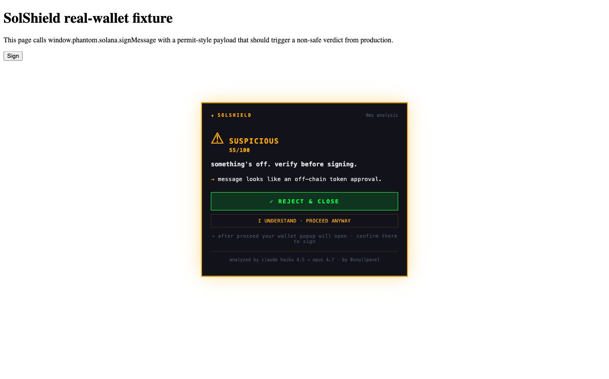
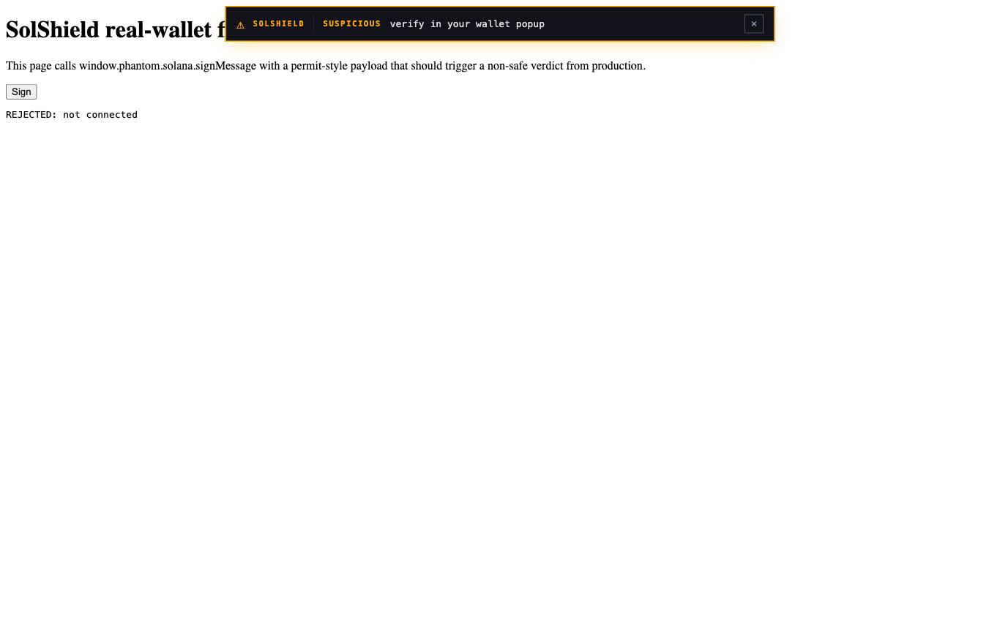
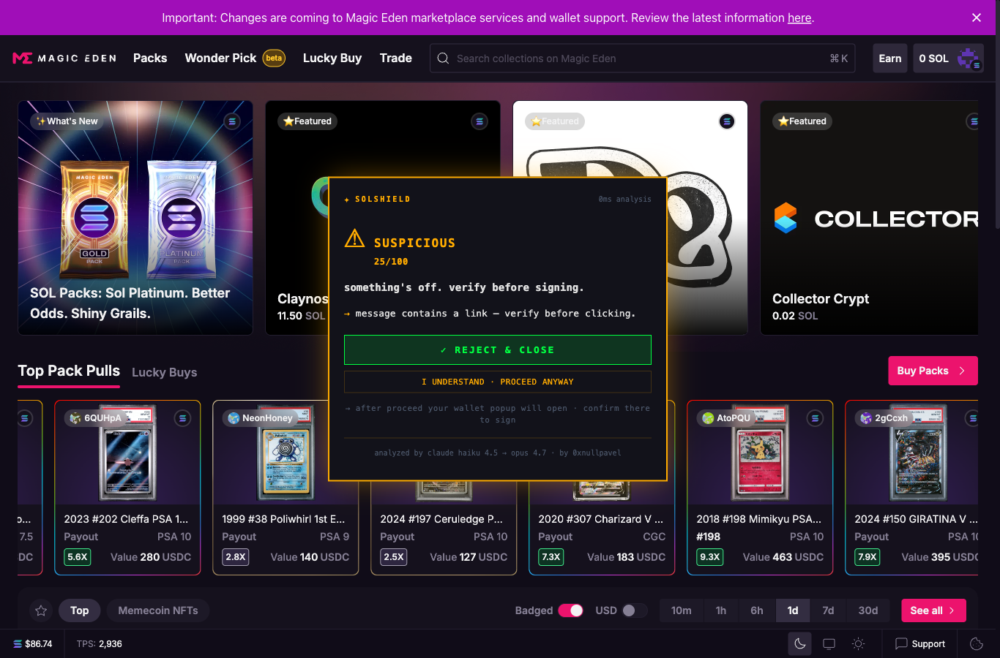
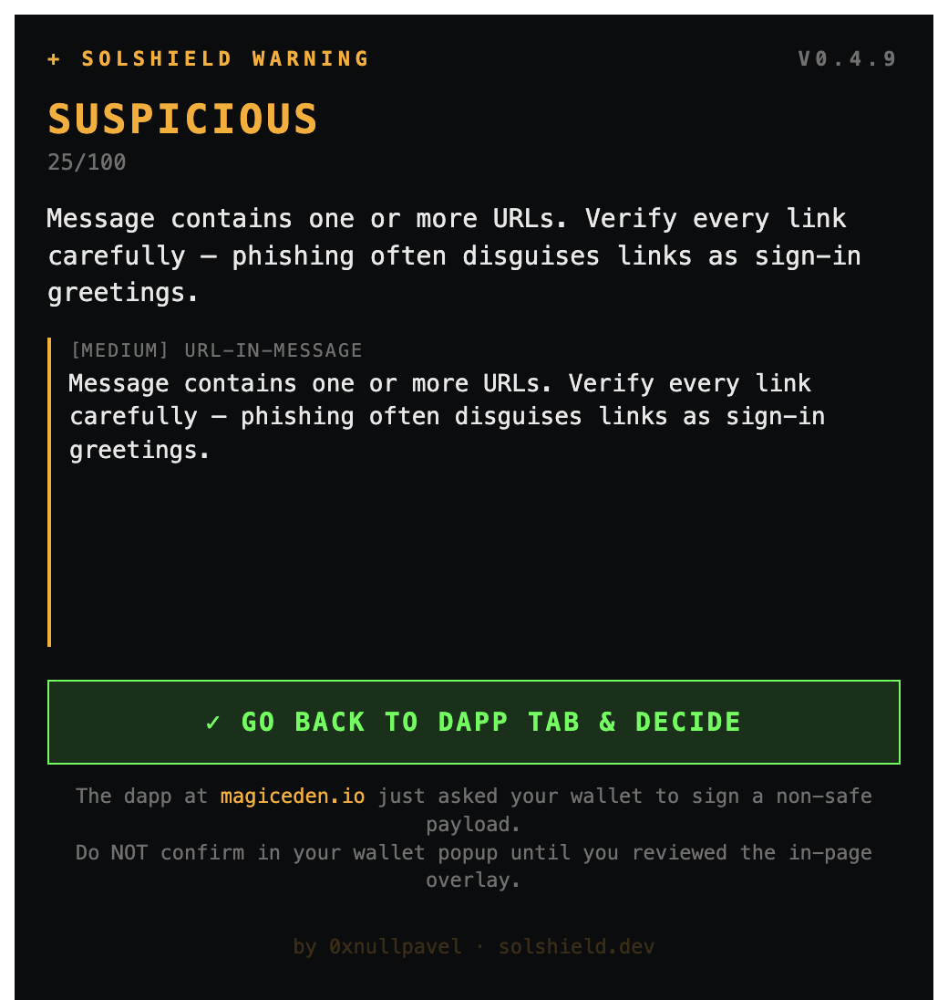
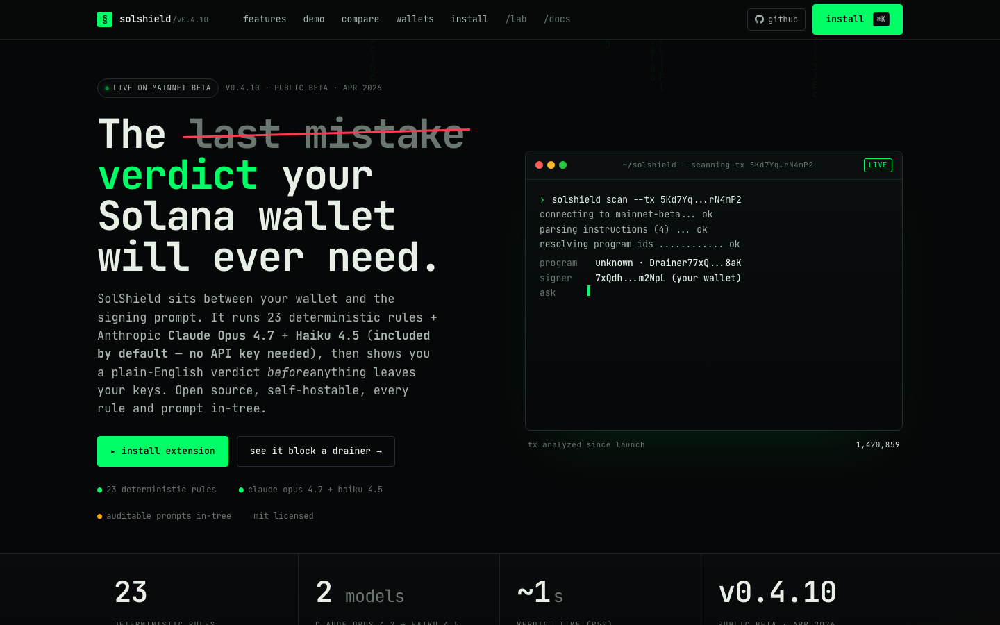

# SolShield

A Chrome extension that looks at what your wallet is about to sign and warns you if it smells like a scam. Before you tap "Confirm".

Works with Phantom, Solflare, Backpack, Glow, Trust and Coin98.



## Why I built this

I've been deep in Solana for a year and I've seen pretty much every flavor of scam at this point. A friend of mine lost about fifteen hundred bucks signing a "Sign in" message on a fake Magic Eden page. The message wasn't really a login, it was an offline permit that let a drainer move all his tokens. Another guy I know signed something "to claim an airdrop" and woke up the next day with no SOL.

There's already Blockaid and Blowfish doing this kind of thing. They're good. But they're closed-source, paid, and you only learn how they work if you sign a B2B contract. I wanted something where I could read every rule and every prompt. Something anyone could run on their own server without asking permission from anyone.

So I built it.

## What it actually does

When a website asks your wallet to sign something:

1. SolShield slips in between the page and your wallet, and grabs the request before your wallet sees it.
2. It sends the bytes to Claude (yes, Anthropic's Claude) along with 23 hand-written rules that catch the usual drainer patterns.
3. It shows you a card with the verdict in plain English: "this is safe", "this looks off, double-check", or "do not sign this, they will empty your wallet".
4. You decide. If you say no, your wallet never even hears about the attempt.

Looks like this when something is sketchy:


Hit "REJECT" and the transaction is cancelled right there. Phantom or Solflare don't even open their popup asking you to confirm:



## A concrete example so it makes sense

Say you land on a page that looks like Magic Eden but is actually `magiceden-airdrop.fake`. It asks you to sign a message that goes:

```
phishing.com wants you to sign in with your Solana account:

Welcome! Sign to verify ownership.
```

Looks like a normal login at first glance. But once signed, that message hands the attacker a cryptographic signature they can use somewhere else. It's called "spoofed SIWS domain" — the message claims to be from one domain (`phishing.com`) but the page asking for it is another (`magiceden-airdrop.fake`).

SolShield notices the message domain doesn't match where you actually are and tags it as danger 90/100. Claude explains it in one sentence:

> "This message claims to be from phishing.com but is actually being requested from magiceden-airdrop.fake — a classic domain spoofing attack. If you sign, attackers could impersonate you or drain your wallet."

You hit Reject. Nothing happened.

## How it looks on real magiceden

Real session with the extension installed, browsing the actual Magic Eden:



When Magic Eden asks you to sign their SIWS login (which is legit), SolShield checks the message, marks it `safe`, and shows nothing. Doesn't bother you when everything's fine. If the message had a weird domain or a permit pattern with token amounts, then it would step in.

## When the wallet hijacks your screen

Phantom opens a full-screen tab when it asks you to confirm. If our card got hidden behind that, we'd be useless. So SolShield also opens a separate browser window outside the page DOM, so you actually see it:



That window has a "GO BACK TO DAPP TAB & DECIDE" button that takes you back to where the overlay with the Reject button lives. It's a four-layer defense: the overlay in the page, an OS-level notification, a red dot on the extension icon, and this popup window. At least one of the four always reaches you no matter how busy your Chrome is.

## The site

`https://solshield.dev`



## How it works under the hood

Three pieces:

**The extension** (`apps/extension`)
What gets installed in Chrome. Two scripts inject into every page: one slips between your wallet and the page to intercept calls, the other handles showing the cards. Built with React + Plasmo.

**The server** (`apps/web`)
A Next.js API that takes the transaction or message, runs 23 deterministic rules over it (stuff like "this program is on the blocklist" or "this message contains a suspicious URL"), and if anything looks off, asks Claude to explain in plain English what's going on. Running on a Hetzner box of mine.

**The rules and prompts** (`packages/core`, `packages/ai`)
Plain text files anyone can read on GitHub. If you think a rule is missing or the Claude prompt could be better, send a PR. Nothing's hidden.

## Why Claude

I tried a bunch. Claude Haiku 4.5 gives me clear short answers in under a second, and costs about $0.001 per analysis. When a transaction is genuinely ambiguous, it escalates to Claude Opus 4.7 which is slower but reads instruction by instruction.

I cover the credits. You install the extension and that's it, no API key needed from you. If usage grows past what I can afford, I'll figure it out then. If you'd rather run the whole thing on your own server with your own key, you can do that too (`docker compose up`).

## Install

Not on the Chrome Web Store yet (uploading once it's more stable). For now:

```bash
git clone https://github.com/ivaldepablo/solshield
cd solshield
pnpm install
pnpm -F @solshield/extension build
```

Then in Chrome:

1. Go to `chrome://extensions`
2. Toggle "Developer mode" top right
3. Click "Load unpacked"
4. Pick the `apps/extension/build/chrome-mv3-prod` folder

You should see the SolShield icon in your toolbar.

## Wallets that work

Tested with real accounts on Solana mainnet:

- Phantom
- Solflare
- Backpack
- Glow
- Trust
- Coin98

Also works with anything that implements the wallet-standard spec.

## What's missing

Stuff I know is pending and I work on when I have time:

- Getting it into the Chrome Web Store
- Detecting cloned tokens from Pump.fun (when a token graduates, there's a few minutes where someone can push a fake one with the same name on Raydium to catch the people who buy fast)
- Firefox support
- Better UX when Phantom opens its full-screen tab and steals focus
- More rules as new drainer patterns show up

If you have ideas, open an issue. If you find a bypass — something malicious SolShield should have caught and didn't — that's the most useful thing you can report.

## Contact

- Repo: [github.com/ivaldepablo/solshield](https://github.com/ivaldepablo/solshield)
- X / Twitter: [@PabloIvalde](https://x.com/PabloIvalde)
- Email: hi@solshield.dev

## License

MIT. Do whatever you want with this. Fork it, improve it, sell it. Just don't pretend to be me.
